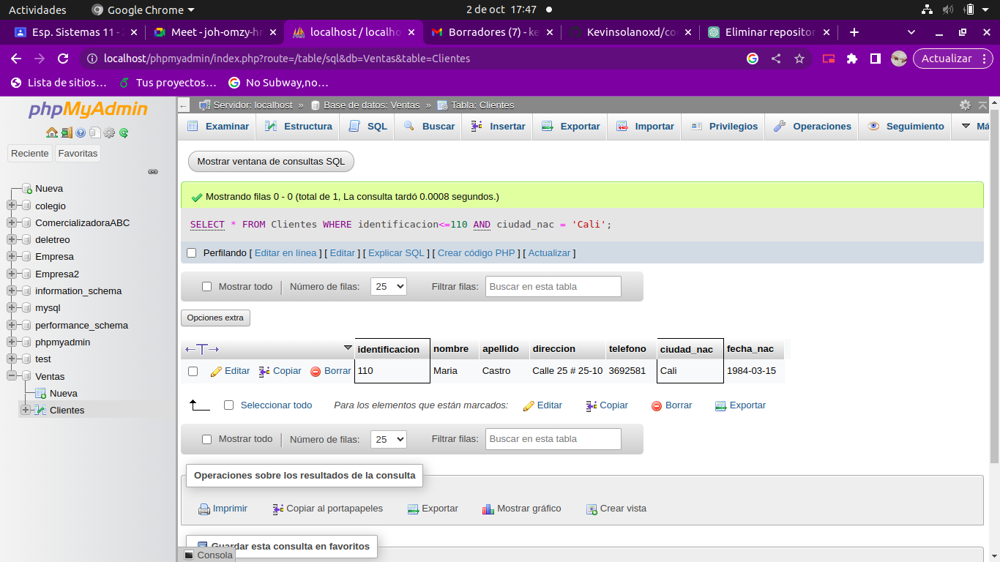
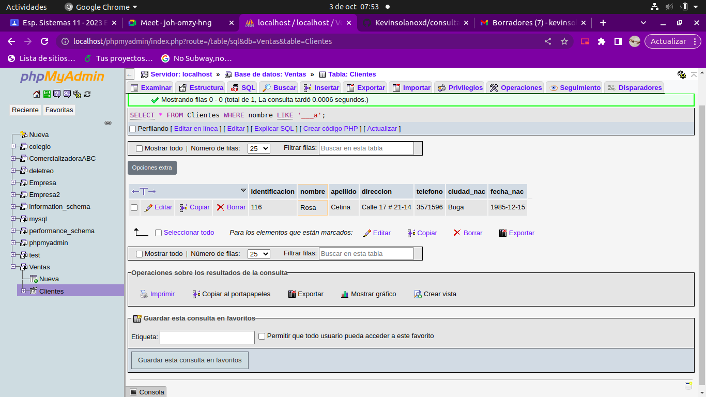

# consultas_1_sql
#  Introduccion a las consultas a una BD usando SQL

## Base de Datos: Ventas
## Tabla Cliente

## Instruccion SELECT
- Permite seleccionar datos de un tabla.
- Su formato es: `SELECT campos_tabla FROM nombre_tabla`

### Consulta No. 1
1. Para visualizar toda la informacion que tiene la tabla Cliente se puede incluir con la instruccion SELECT el caracter **\*** o cada uno de los campos de la tabla

- `SELECT * FROM Cliente`

- `SELECT identificacion, nombre, apellido, direccion, telefono, ciudad_nac, fecha_nac FROM Cliente`

### Consulta No. 2

2. Para visualizar solamente la identificación del Cliente: `SELECT identificacion FROM Cliente`

### Consulta No. 3

3. Si se desea obtener los registros cuya identificacion sea mayor o igual a 150, se debe utiliza la clásula `WHERE` que especifica las condiciones que deben reunir los registros que se van a seleccionar: `SELECT * from Cliente WHERE identificacion>=150`

`SELECT * from Clientes WHERE identificacion>=150`

### consulta No. 4

4.se desea obtener los registros cuyos apellidos sean Vanegas o Cetina, se debe utilizar el operador IN que espesifica los registros que sequieren visualizar de una tabla.

`SELECT apellido,nombre FROM clientes WHERE apellido, IN ('Vanegas','Cetina')`

o se puede utilizar el operador 'OR'

`SELECT apellido FROM clientes WHERE apellido ='Vanegas' OR apellido= 'Cetina' `

### consulta No. 5

5. se desea obtener los registros cuya indetificación sea menor de 110 y culla ciudad sea cali, se debe utilizar el aperador 'AND'

`SELECT * FROM Clientes WHERE indetinficacion<=110 AND ciudad = 'Cali'`

### consulta relacion uno a muchos 

Explicación de cómo crear una relación uno a muchos en phpMyAdmin

-Creación de la tabla principal

 Primero, debemos crear la tabla principal. Para ello, es necesario definir los campos que la compondrán. Por ejemplo, en la tabla "Clientes" se podrían incluir campos como "id_cliente", "nombre", "apellido", "email", entre otros.

-Creación de la tabla secundaria

 Luego, debemos crear la tabla secundaria que contendrá los registros relacionados con la tabla principal. En nuestro ejemplo, la tabla "Facturas" tendría campos como "id_factura", "id_cliente" (clave foránea), "fecha", "concepto", "importe", etc.

-Establecimiento de la relación

 Finalmente, establecemos la relación entre ambas tablas. Para ello, se debe definir la llave foránea "id_cliente" en la tabla "Facturas" que se relacione con la llave primaria "id_cliente" en la tabla "Clientes". En phpMyAdmin, esta relación se puede establecer de forma manual en la consola o de manera gráfica mediante la herramienta de diseño.

Opciones para crear la relación: consola y gráfica

-Consola: Para establecer la relación mediante comandos SQL, se debe utilizar la sintaxis ALTER TABLE. Este    método requiere conocimientos avanzados de SQL y su uso puede ser más propenso a errores.

-Gráfica: En cambio, la interfaz gráfica de phpMyAdmin permite establecer la relación de manera visual y sencilla. Para ello, se debe acceder a la herramienta de diseño y arrastrar la llave foránea de la tabla  secundaria hasta la llave primaria de la tabla principal.

### consulta No. 6

6. si se desea obtener los registros y los nombres empiezen con la letra "A", se debe utilizar el operador `LIKE` que utiliza los patrones `&` (todos) y
`_` (caracter)

`SELET + FROM Clientes WHERE nombre  LIKE `A%``

### consulta no. 7

7. se desea obtener los registros cuyos nombren contengan la letra  

`SELECT * FROM Clientes WHERE nombre LIKE '%a%'`

### consulta no 8

8. se desea obteer los registros donde la cuarta letra del nombre del cliente sea la letra 'a'

`SETEC * FROM Clientes WHERE nombre LIKE '___a'`

### consulta 9

9. se desea obener los registros culla identificacion este entre el intervalo 110 y 150 se debe utilizar la calpsula BETWEEN que sirve para espesificar un intervalo de valores

`SELECT * FROM Clientes WHERE identificacion BEWEEN 110 AND 150`

# Istruccion DELETE
-permite borrar todos o un gupo espesifico de una tabla
-su formato es: `DELETE FROM nombre_tabla`

### ELIMINACION 1

1. eliminar los registos cuyas identificacion sea mayor a 169

`DELETE FROM Clientes WHERE identificacion >169`

### eliminacion 2

2. eliminar los registros cuya identificacion sea igual a 116

`DELETE FROM Clientes WHERE identificacion =116`

# instruccion UPDATE

-permite actualizar un cmpo de una tabla
-su formto es UPDATE noombre-tabla nombre_campo = valor

### Actualizacion No.1

1. Para actualizar la ciudad de nacimiento de cristian vanegas cuya identificacion es 114

`UPDATE Cliente SET ciudad_nac = 'Pereira' WHERE identificacion=114`

## creacion tabla pedido
### diccionario de datos

|campo|tipo de dato|Longitud|
|-----|------------|--------|
|***no_pedido***|varchar|15|
|iden_cliente|varchar|15|
|fecha_compra|date||
|fecha_vencimiento|date||
|observacion|varchar|30|

### Tabla pedido

### modelo entidad relacion 

## operador INNER JOIN

-permite obtener datos de dso o mas tablas.

-cuando se realiza la contenacion de las tablas no necesariamente se debemostar todos los datos de las tablas
-su formato es:

`SELECT tabla1.campo , tabla2.campo ... FROM tabla_principal INNER JOIN tabla secundaria ON campo_comun_tabla1= campo_comun_tabla`

1. para visualizarlos campos indentificacion,nombre,apellidos de la tabla cliente yno_pedido, fecha compra, fecha vencimiento y observacion de latabla pedido, se debe realizar la siguiente instrupcion 

`SELECT Clientes.identificacion,Clientes.nombre, Clientes.apellido, Pedido.no_compra, Pedido.fecha_compra, Pedidio.fecha_vencimiento, Pedido.observacion FROM Clientes INNER JOIN Pedido`

2. para visualizar los campos de las tablas clientes y pedido donde indentificacion sea mayor que 100 se debe realizar la siguientte instruccion 

`SELECT Clientes.*, pedido.* FROM Clientes INNER JOIN pedido ON Clientes.identificacion = pedido.iden_cliente WHERE Clientes.identificacion=100`

[INNER 2](INNER2.png "INNER 2")
